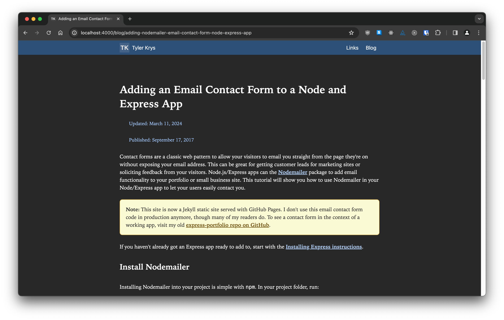

# jekyll-portfolio

A [Jekyll](https://jekyllrb.com/)-based static site that serves [my portfolio website](https://tylerkrys.ca).

## Installation

Having a [Ruby development environment](https://jekyllrb.com/docs/installation/) is a prerequisites to working with this project locally.

### Install

`bundle install`

### Update gem versions

`bundle update`

### Build site only

`bundle exec jekyll build`

### Build site and serve locally

`bundle exec jekyll serve`, then visit http://localhost:4000 in your browser.

### Build site and serve in production

GitHub Pages is set up for automatic deployment upon, but other deployment environments may need you to specify the `JEKYLL_ENV` environment variable: `JEKYLL_ENV=production bundle exec jekyll build`

## Author

[Tyler Krys](https://tylerkrys.ca) made this to take advantage of [GitHub Pages](https://pages.github.com/).
